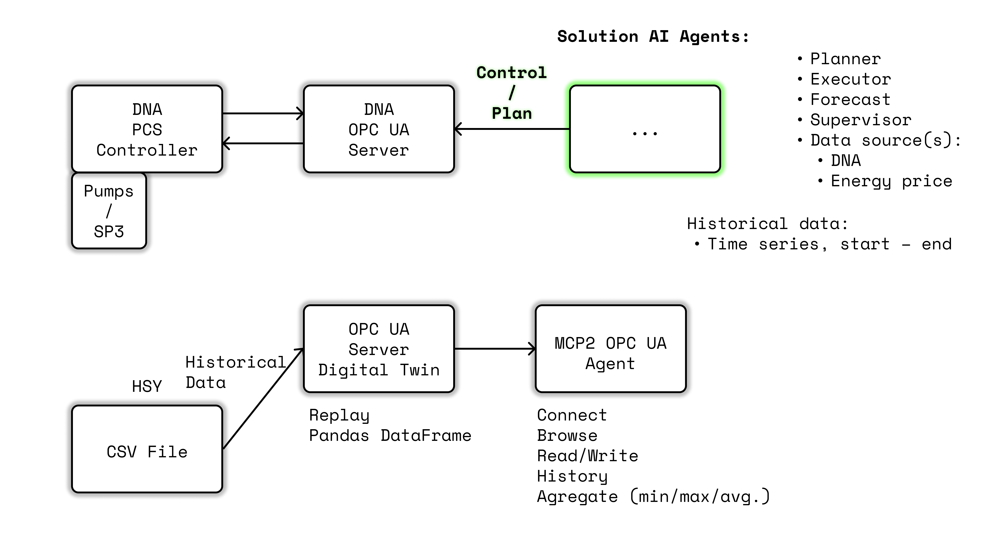

Intelligent Flow Optimization
by Valmet x HSY

The Challenge
Build a multi-agent AI that autonomously minimizes wastewater pumping energy—one of the most critical processes in modern infrastructure—by forecasting inflow, power prices, and flow dynamics in real time.

Every city relies on invisible systems that keep life running—and wastewater management is one of the most critical. Pumps operate nonstop, consuming massive amounts of energy while facing the chaos of inflow, storms, and fluctuating electricity prices. What if these networks could think for themselves? With multi-agent AI, Valmet and HSY invite you to transform static infrastructure into a living system that predicts, adapts, and optimizes wastewater flow in real time.

Wastewater networks operate 24/7 and cannot stop — yet they hide untapped potential for intelligent optimization. Each pumping station must balance constant flow, limited storage, and fluctuating electricity prices while staying resilient to stormwater surges. Traditional automation follows fixed rules and ignores real-time changes and forecasts. Your task is to build a multi-agent AI system where autonomous agents plan pumping according to daily energy prices, incoming flow, and downflow process requirements, and find the most energy-efficient pumping strategy without violating safety or process constraints. The goal: make one of society’s most critical infrastructure systems self-optimizing.

Insight
HSY has long period of data from the pumping wastewater

and storm rain can be nowadays forecasted. Multi-agents

solution can find solution that human can not figure out.

Electricity prices shift by a 15 minute period, while pumps must obey strict flow limits to prevent system failures. HSY holds decades of real wastewater and inflow data—perfect ground truth for AI to learn from. The real challenge is coordination: can multiple autonomous agents, each with their own goals and data streams, discover pumping strategies no human operator could design?

Example suggestion:

One agent could handle short-term energy price forecasting, another could manage storage canal capacity and a third could optimize flow distribution between pumps.

Resources
Participants will have access to HSY’s historical wastewater and inflow datasets—real operational data spanning years of environmental variation. System communication and control will be implemented through the OPC UA protocol, the industrial standard for secure, real-time data exchange. Mentors from Valmet, HSY, and Aalto University will provide hands-on guidance in areas such as process automation, multi-agent architectures, and in future solutions can be tested with digital twin simulation. Teams are free to use any AI framework of their choice—from reinforcement learning environments to optimization libraries or custom-built agent systems.

Resources:

Junction_HSY_task_description.pptx

Hackathon_HSY_data.xlsx

Junction x HSY x Valmet.pdf

HSY_Valmet_Junction_data.zip

